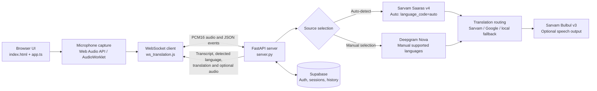

# Live Indic Translator

Live Indic Translator is a browser application for real-time speech transcription and translation. It captures microphone audio, streams it to a Python WebSocket server, displays recognized speech and translated text, and can persist translation sessions and utterances to Supabase.

[**Open the hosted application**](https://liveindic-translator.onrender.com)

The application supports English, Hindi, Tamil, Telugu, Kannada, and Malayalam. Speakers can select a source language manually or choose **Auto-detect** and select a target language independently.

> **Important:** Auto-detect requires the Sarvam Saaras v4 real-time speech API and a valid `SARVAM_API_KEY`. Mock mode does not recognize real speech. Deepgram is used for supported manually selected source languages and is not sent `language=auto`.

## Contents

- [Features](#features)
- [Hosted application](#hosted-application)
- [System architecture](#system-architecture)
- [Technology stack and models](#technology-stack-and-models)
- [Requirements](#requirements)
- [Install dependencies](#install-dependencies)
- [Configure services](#configure-services)
- [Run the application](#run-the-application)
- [Reproduce a live translation](#reproduce-a-live-translation)
- [Tests and validation](#tests-and-validation)
- [Troubleshooting](#troubleshooting)
- [Repository layout](#repository-layout)
- [Security and privacy](#security-and-privacy)

## Features

- Live microphone capture and PCM16 audio streaming.
- Automatic spoken-language detection for English, Hindi, Tamil, Telugu, Kannada, and Malayalam through Sarvam Saaras v4.
- Manual source-language selection with the existing provider routing retained.
- Real-time transcripts, detected-language badge, final translations, and optional synthesized speech.
- Target-language selection independent of Auto-detect.
- Supabase authentication, saved language preferences, session history, and transcript/translation persistence where credentials, schema, and authorization permit.
- Guest live sessions when session creation is unavailable; guest sessions are not associated with a signed-in account for history.
- Mock paths for development and automated tests. Mock ASR does **not** transcribe microphone audio.

## Hosted application

Try the deployed application at [liveindic-translator.onrender.com](https://liveindic-translator.onrender.com). Allow microphone access when prompted. Live speech recognition and translation depend on the deployed backend, valid provider credentials, network connectivity, and provider availability.

The frontend uses `http(s)://<backend-host>:8000` locally by default. For deployment, set `window.LIVE_TRANSLATION_BACKEND_URL` to the backend's public HTTP(S) or WS(S) origin in a script loaded before `ws_translation.js`; the app converts HTTP(S) to WS(S) and connects to `/ws/translate`. An HTTPS frontend requires an HTTPS/WSS backend. For example, place this before the existing `ws_translation.js` script tag in `index.html`:

```html
<script>
  window.LIVE_TRANSLATION_BACKEND_URL = "https://your-backend.example.com";
</script>
```

Keep `SARVAM_API_KEY` and other provider credentials in the backend's environment only—never in frontend configuration.

## System architecture



### Audio and request flow

1. The browser asks for microphone access using `getUserMedia`.
2. Web Audio captures mono samples at 16 kHz and converts them to signed 16-bit PCM. The app uses `AudioWorklet` where available and falls back to `ScriptProcessorNode` in browsers that cannot load the worklet.
3. `ws_translation.js` streams the PCM frames to `ws://<same-host>:8000/ws/translate`.
4. `server.py` selects an ASR provider based on the chosen source language and configured credentials.
5. For Auto-detect, Sarvam returns transcript events and a detected language. The server normalizes the provider code, translates using the detected source, and includes the language in the transcript response.
6. The browser updates the transcript, language badge, and translation. When available, the server can also return generated speech.
7. When Supabase is available and the session is authenticated, final transcript and translation records can be saved. Audio itself is streamed, not stored as an audio recording.

### ASR routing

| Source selection | Provider behavior |
| --- | --- |
| Auto-detect | Requires `SARVAM_API_KEY`; connects to Saaras v4 using `language_code=auto`. It does not fall back to Deepgram. |
| Malayalam | Uses Sarvam Saaras v4 when the Sarvam key is configured. |
| Other manually selected languages | Uses Deepgram Nova when `DEEPGRAM_API_KEY` is configured. If Deepgram is not configured and Sarvam is, uses Sarvam with the selected language code. |
| No applicable ASR credentials | Enters a mock/no-provider path; real speech transcription is unavailable. |

For translation, the standalone server uses Sarvam Translate v1 for supported Indic language pairs when configured, can use Google Cloud Translation API v2 when `GOOGLE_API_KEY` is configured, and otherwise returns a local placeholder translation. Sarvam Bulbul v3 speech generation is optional and requires Sarvam credentials.

## Technology stack and models

### Frontend

- HTML5 and CSS3.
- TypeScript 5, compiled to `dist/app.js`.
- Vite 8 for local development.
- Supabase JavaScript client (`@supabase/supabase-js`).
- Browser APIs: `getUserMedia`, Web Audio API (`AudioWorklet` with compatibility fallback), and WebSocket.

### Backend

- Python 3.10 or newer.
- FastAPI and Uvicorn.
- `websockets` for provider and browser streaming connections.
- `httpx` and `requests` for asynchronous and synchronous HTTP API calls.
- Supabase Python client for session/history persistence.

### Providers and models

- **Sarvam Saaras v4:** real-time ASR; adaptive `language_code=auto` is used for automatic detection.
- **Sarvam Translate v1:** text translation.
- **Sarvam Bulbul v3:** optional translated speech generation.
- **Deepgram Nova 2 / Nova 3:** ASR for manually selected languages when configured. Auto-detect is deliberately routed away from Deepgram.
- **Google Cloud Translation API v2:** optional translation provider/fallback when `GOOGLE_API_KEY` is configured.
- **Mock ASR and translation:** development/test paths; mock ASR does not identify or transcribe actual speech.

## Requirements

- Windows, macOS, or Linux.
- Git.
- Node.js and npm.
- Python 3.10 or newer.
- A browser with microphone and Web Audio support. Use `localhost` or HTTPS; browsers generally block microphone capture on insecure remote origins.
- For real Auto-detect: a valid Sarvam API key, internet access, and permission to use Sarvam Saaras v4.
- Optional: a Deepgram API key for manual source-language ASR.
- Optional: a Google Cloud API key for Google translation.
- Optional: a Supabase project with the schema and row-level-security policies used by the application for authenticated history and persistence.

## Install dependencies

Run commands from the repository root.

### Frontend

```powershell
npm install
npm run build
```

### Python backend

Create a virtual environment:

```powershell
py -3 -m venv .venv
.\.venv\Scripts\Activate.ps1
python -m pip install --upgrade pip
```

Install the repository and modular-backend dependencies:

```powershell
python -m pip install -r requirements.txt
python -m pip install requests pydantic pydantic-settings
```

The standalone `server.py` imports `requests`, which is not currently listed in the root requirements file. `pydantic-settings` is needed to load the optional REST routers mounted by the standalone server. The modular service's runtime dependencies are included in the root requirements file; the additional packages above cover its settings model as well.

For bash shells, the equivalent virtual-environment and install commands are:

```bash
python3 -m venv .venv
source .venv/bin/activate
python -m pip install --upgrade pip
python -m pip install -r requirements.txt requests pydantic pydantic-settings
```

For the documented automated tests:

```powershell
python -m pip install pytest pytest-asyncio
```

## Configure services

### Recommended configuration for `server.py`

The standalone `server.py` loads environment variables from the repository-root `.env` first, then `backend/.env` for variables not already set. To avoid ambiguous values, keep one authoritative file for the server you run; for this standalone entry point, use the root `.env`.

Create `.env` in the repository root. Never commit it:

```dotenv
# Required for automatic spoken-language detection:
SARVAM_API_KEY=<your-sarvam-api-key>

# Optional: used for manually selected source-language ASR when configured.
DEEPGRAM_API_KEY=<your-deepgram-api-key>

# Optional: translation fallback.
GOOGLE_API_KEY=<your-google-cloud-api-key>

# Optional: Supabase persistence. Use credentials for the same project
# configured by the frontend, and only if the project schema/policies exist.
SUPABASE_URL=<your-supabase-project-url>
SUPABASE_ANON_KEY=<your-supabase-publishable-or-anon-key>
SUPABASE_KEY=<server-only-service-role-key>
```

For Auto-detect, `SARVAM_API_KEY` is required even if a Deepgram key is present. The standalone server does not use `TRANSLATION_PROVIDER` to choose the ASR route; it selects based on the source language and available provider keys. Do not set `SARVAM_API_KEY` to a placeholder value.

`SUPABASE_KEY` is optional and must remain backend-only. The frontend already contains a Supabase project URL and publishable key in `app.ts`; use the matching project configuration if you want sessions and history stored in the same database. Do not use a local Supabase URL unless that local project is running and contains the required schema.

### Alternative: modular FastAPI service

The repository also contains a separate backend application at `backend/app/main.py`. It reads `backend/.env` (then root `.env` for missing variables) and selects providers using `TRANSLATION_PROVIDER`. To run this service instead of `server.py`, create `backend/.env` with at least:

```dotenv
TRANSLATION_PROVIDER=sarvam
SARVAM_API_KEY=<your-sarvam-api-key>
SUPABASE_URL=<your-supabase-project-url>
SUPABASE_ANON_KEY=<your-supabase-publishable-or-anon-key>
```

For mock-only development, set `TRANSLATION_PROVIDER=mock`; mock mode does not recognize live speech and is not suitable for testing real Auto-detect.

Both backend entry points listen on port `8000` by default. **Run only one at a time**. The root README's recommended live demonstration below uses `server.py`, the standalone server where the current Auto-to-Sarvam behavior is implemented.

### Supabase schema

The SQL files in `supabase/migrations/` describe the project schema, language seeds, and related policies. For an existing hosted project, verify that the required migrations and seed data have already been applied before testing persistence. Do not reset or migrate a production/hosted project as part of ordinary local setup. Live speech can be tested independently of persistence if Supabase is unavailable; history and saved records then will not be available.

## Run the application

Start the backend and frontend in two separate terminals.

### Terminal 1: standalone backend

```powershell
cd C:\path\to\The-Unscripted
.\.venv\Scripts\Activate.ps1
python server.py
```

The server should report that Uvicorn is listening on port `8000`. For Auto-detect, after starting a session it should log a connection to `sarvam-saaras-v4` for language `auto`. If it reports `deepgram-nova-2` for `auto`, you are running an outdated copy of `server.py`.

### Terminal 2: frontend

```powershell
cd C:\path\to\The-Unscripted
npm run dev -- --host 127.0.0.1 --port 5500
```

Open the URL printed by Vite, usually `http://127.0.0.1:5500`. A static server such as VS Code Live Server on port `5500` can also serve the frontend, but Vite is the documented development setup. The page expects the compiled `dist/app.js`, so run `npm run build` after changing `app.ts`.

To use the modular backend instead, stop the standalone server and start this in a separate terminal:

```powershell
cd C:\path\to\The-Unscripted
.\.venv\Scripts\Activate.ps1
cd backend
python -m uvicorn app.main:app --reload --host 0.0.0.0 --port 8000
```

## Reproduce a live translation

1. Install the frontend and Python dependencies and configure the root `.env` as described above.
2. Start `python server.py` and the frontend server. Confirm that both terminals remain running.
3. Open the page on `localhost` and allow microphone access. Select the correct microphone in the browser/operating system if there is more than one.
4. Select **Auto-detect** as the source and choose a target language. Alternatively, select a source language manually to test the existing manual-provider path.
5. Click **Start Speaking** and speak a short, clear sentence in one supported language.
6. In Auto mode, confirm that the recognized-speech badge changes from **Detecting...** to the detected language and transcript text appears. Confirm the target panel shows the translation.
7. Click **Stop** to close the stream.
8. If signed into Supabase and persistence is configured, open **History** to inspect saved sessions and utterances. Guest sessions provide live use without account history.

### Expected behavior

- In Auto mode, the backend log identifies Sarvam Saaras v4 with `language: auto`; it must not request Deepgram using `language=auto`.
- A detected source language is used as the translation source and included in transcript response messages. Where the Supabase schema and access policies permit, it is associated with the utterance/session.
- Manual selection continues to use the provider route appropriate to its language and available keys.
- Mock ASR does not create real transcripts. A working microphone indicator or active WebSocket alone does not prove that a provider recognized speech.

Recognition and translation quality vary with the microphone, audio level, background noise, accent, network, API availability, and provider account limits. This project does not claim a quantified accuracy or latency benchmark.

## Tests and validation

Run frontend checks from the repository root:

```powershell
npm run build
node --check ws_translation.js
node --check audio_capture_processor.js
git diff --check
```

Run the focused Python tests from the repository root:

```powershell
$env:PYTHONPATH = (Join-Path (Get-Location).Path 'backend') + ';' + (Get-Location).Path
python -m pytest -q backend\tests\test_standalone_server_auto_detection.py backend\tests\test_sarvam_provider.py backend\tests\test_streaming.py
```

For bash, use:

```bash
PYTHONPATH=backend:. python -m pytest -q backend/tests/test_standalone_server_auto_detection.py backend/tests/test_sarvam_provider.py backend/tests/test_streaming.py
```

The tests cover provider routing, the Auto-to-Sarvam request, manual-language routing, Sarvam transcript parsing, detected-language normalization, streaming behavior, and orchestrator handling. They use test doubles; passing them does not validate real API credentials or network connectivity. Integration tests may require a correctly configured Supabase project and should not be run against a database that can be damaged by test writes.

## Troubleshooting

### The session closes shortly after clicking Start

- Check the browser console and the backend terminal for the first error.
- Confirm the browser is connected to port `8000` and only one backend process is running.
- If Auto is selected, confirm the **server process's** environment has a real `SARVAM_API_KEY` and restart the server after editing `.env`.
- If the log says `deepgram-nova-2 ... language: auto`, update the local checkout and run the new `server.py`; the standalone Auto fix routes to Sarvam.
- `server rejected WebSocket connection: HTTP 400` means the configured ASR provider rejected the connection. Verify provider routing, API key validity, account access, and the provider's current endpoint requirements.
- `[Errno 11001] getaddrinfo failed` on Windows indicates DNS/name resolution or network access failed before a provider connection was established.

### The microphone appears inactive or no speech is transcribed

- Use `http://localhost`/`http://127.0.0.1` or HTTPS, allow microphone permission, and check the selected input device.
- Keep the browser page open while speaking and verify the WebSocket is connected.
- Confirm that the selected ASR provider is configured. Mock ASR intentionally does not transcribe actual audio.
- If `audio_capture_processor.js` returns 404, ensure the frontend server is serving the repository root and the worklet file exists at that path.
- A ScriptProcessor deprecation warning is not itself an ASR error. The frontend prefers AudioWorklet and contains a compatibility fallback.

### `No module named 'pydantic_settings'`

Install it with `python -m pip install pydantic-settings`, then restart the server. In standalone `server.py`, the notice means optional REST routers could not be imported; it does not by itself explain a Sarvam/Deepgram WebSocket rejection.

### Supabase login, history, or persistence fails

- Confirm `SUPABASE_URL` points to the same project configured in `app.ts`, and that the project's schema, seed rows, and RLS policies are installed.
- Do not point only the backend at `127.0.0.1:54321` unless the local Supabase stack is running and the frontend is configured for that same local project.
- Inspect the failed Supabase request in the browser Network panel or the backend log. Do not share access tokens, passwords, or server keys.

### The frontend looks unchanged after a code update

- Confirm the browser is open to the checkout that contains the latest files. A second clone or a friend's folder does not update automatically when GitHub changes.
- Rebuild after editing TypeScript: `npm run build`.
- Restart the backend after changing Python code or environment values; verify the server process is running from the intended repository directory.

## Repository layout

```text
.
├── app.ts                         # Frontend auth, preferences, sessions, and history
├── audio_capture_processor.js     # AudioWorklet PCM16 capture processor
├── dist/app.js                    # Compiled frontend module loaded by index.html
├── index.html                     # Application interface
├── server.py                      # Standalone FastAPI/WebSocket server (recommended demo)
├── ws_translation.js              # Microphone, audio and WebSocket client
├── style.css                      # Application styles
├── backend/
│   ├── app/                       # Modular FastAPI service and streaming pipeline
│   ├── tests/                     # Provider, streaming, and routing tests
│   └── requirements.txt           # Modular-backend dependencies
├── requirements.txt               # Standalone server Python dependencies
└── supabase/
    └── migrations/                # Schema, policies, and supported-language seed data
```

## Security and privacy

- Keep Sarvam, Deepgram, Google, and Supabase server/service-role keys in local environment files or a secrets manager. Never commit `.env` files or paste secret values into issues, chat, or logs.
- The Supabase publishable/anon key is intended for client-side use; access control must be enforced by Supabase Row Level Security. Never put a service-role key in frontend code.
- Microphone audio is streamed to the selected speech provider for recognition. The application does not save a raw audio recording.
- Transcripts, translations, language metadata, and session information may be persisted when the configured Supabase project and authorization policies allow it.
- Check provider terms, account settings, regional availability, privacy requirements, and retention policies before using real user speech.
