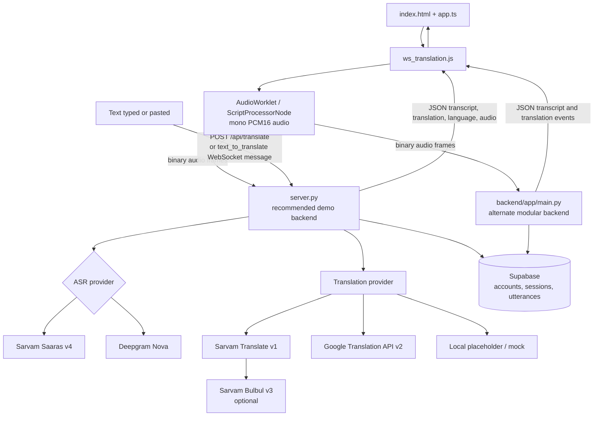

# Backend and End-to-End Implementation Flow

This document explains how the browser, speech providers, translation providers, and Supabase fit together. For the project overview, prerequisites, installation, configuration, and reproduction steps, see the [root README](../README.md).

## Two backend entry points

There are two FastAPI implementations in this repository. They share provider concepts and Supabase storage, but are separate applications with different provider selection and persistence flows. Run only one on port `8000` at a time.

| Entry point | Application | Provider selection | Best use |
| --- | --- | --- | --- |
| `server.py` | Standalone FastAPI app at the repository root | Selects ASR from source language and available `SARVAM_API_KEY` / `DEEPGRAM_API_KEY`; text translation routes through Sarvam, Google, or a local placeholder | Recommended end-to-end browser demonstration |
| `backend/app/main.py` | Modular FastAPI app | `TRANSLATION_PROVIDER=sarvam` selects Sarvam ASR and translation services; otherwise mock services are used | Modular streaming pipeline, service separation, and queue-based persistence |

The root [README](../README.md) documents dependency installation and commands to run either application.

## System map



The two server boxes represent alternatives: the frontend connects to the backend URL it is configured to use; it does not send the same stream to both backends.

## Protocol and control messages

The browser-facing WebSocket path is `/ws/translate` on either backend, though the initial configuration and service implementation differ:

- The standalone server receives live speech configuration and control messages through its `frontend_receiver` task and places audio/control work on an asyncio queue consumed by its provider loop. Its initial configuration includes the session, selected languages, optional conversation pair and language IDs, and auth token.
- The modular endpoint first receives a JSON configuration message, validates required session/language/token fields, initializes the orchestrator and ASR service, then handles subsequent binary audio frames and text control messages.
- Both clients use JSON for configuration/control and binary WebSocket frames for audio. Responses are JSON events such as `asr_partial`, `asr_final`, `translation_partial`, `translation_final`, `language_detection_failed`, `audio_ready`, `info`, and `error`. Not every event is emitted by both backend implementations.
- `end_utterance` asks the modular orchestrator to finalize and drain queued persistence. The standalone service shuts down the active upstream stream when the client stops or changes source language.
- The standalone backend also exposes `POST /api/translate` for text requests. The modular backend's WebSocket endpoint accepts a direct `text_to_translate` message as its initial request; it is not a replacement for the standalone HTTP route.

## Browser responsibilities

- `index.html` defines the language selectors, source and target textareas, microphone controls, translation actions, sign-in UI, and history UI.
- `app.ts` provides Supabase authentication, profile and language-preference handling, session/history views, and related UI behavior. Vite compiles it to `dist/app.js`, which the page loads.
- `ws_translation.js` manages source/target language changes, WebSocket sessions, microphone lifecycle, transcript rendering, typed-text translation, and optional playback.
- `audio_capture_processor.js` is the AudioWorklet processor. It emits PCM16 frames; the client also contains a `ScriptProcessorNode` fallback for browsers where the worklet is unavailable.
- The worklet uses 2048-sample frames. At 16 kHz that is approximately 128 ms per frame.

## Live speech request flow

1. The user selects source and target languages and presses **Start Speaking**. For a signed-in user, the frontend attempts to create a Supabase-backed session; if that is unavailable, it can start a guest session.
2. The browser requests microphone permission with `getUserMedia`, creates a mono audio graph, resamples to 16 kHz, converts samples to signed PCM16, and streams the frames as binary WebSocket messages.
3. The initial WebSocket JSON message provides the session ID, source and target language codes, optional language IDs, and the user's access token (or the guest marker).
4. The server selects an ASR provider, sends the audio frames upstream, and consumes transcript events. Partial and final ASR messages are sent back to the browser as JSON.
5. The server translates transcript text. It sends partial translation updates when available and a final translation event when the provider finalizes the utterance.
6. The browser updates the source and target textareas and language badges. If audio is generated, it is delivered as base64-encoded audio and played only when available/requested by the active flow.
7. On stop, the client ends the utterance and closes the stream. Session/transcript/translation persistence depends on the backend path, authentication, database schema, and authorization policies. Raw microphone audio is streamed; it is not stored as an audio recording by this application.

### Standalone ASR selection (`server.py`)

The standalone server cleans placeholder API-key values before routing:

| Source selection | Routing behavior |
| --- | --- |
| Auto | Requires Sarvam and opens Saaras v4 with `language_code=auto`. It does not pass `auto` to Deepgram. |
| Malayalam | Uses Sarvam Saaras v4 when a Sarvam key is present. Otherwise it can use Deepgram if configured. |
| Other supported manual languages | Uses Deepgram Nova when configured; selects Nova 3 for Tamil, Telugu, and Kannada and Nova 2 for English and Hindi. If Deepgram is unavailable but Sarvam is configured, uses Saaras v4 with the selected language. |
| No provider credentials | Uses the mock/no-provider path; it cannot recognize real microphone audio. |

Sarvam transcript events can carry language and confidence metadata. The server normalizes detected language codes and uses the detected source language when translating. The detected language is sent back to the browser and can be associated with a persisted utterance when the schema and session permissions allow it.

### Two-way Conversation Mode

Conversation Mode is implemented in the standalone server and corresponding frontend. It uses one continuously active microphone stream for a configured pair of languages:

1. The browser requires two different explicit source/target choices, then sends `conversation_mode: true` and their language codes in the initial WebSocket configuration. It initializes a turn list and keeps the microphone running.
2. Auto-detect ASR is used for the stream. At each final transcript, `resolve_conversation_turn()` combines provider language/confidence with script detection. A supported Indic script takes precedence over a conflicting provider language guess.
3. A confidence below `0.6`, missing/unsupported detection, or a detected language outside the selected pair produces `language_detection_failed` with a reason and turn ID. The server does not guess a translation for that turn.
4. When the detected language belongs to the pair, the other pair member becomes the target. The backend sends the final transcript and translation with language direction and turn ID; the frontend updates the matching conversation card.
5. For an uncertain/out-of-pair turn, the user selects its intended source language and clicks **Correct & translate**. The frontend sends the original text, corrected pair, turn ID, and a correction marker over the still-open socket; the server replies with the corresponding translation event.

Turns are labeled by language only. The system does not diarize speakers, and it expects participants to take turns with enough pause for ASR finalization. Conversation Mode needs real Sarvam Saaras v4 auto-detection and is distinct from one-way manual-language streaming.

### Modular streaming pipeline (`backend/app`)

The modular server mounts its WebSocket endpoint from `backend/app/api/endpoints/ws.py`. That endpoint builds the services through `get_provider_factory()`:

- `TRANSLATION_PROVIDER=sarvam` creates `SarvamASRService` and `SarvamTranslationService`.
- Other values, including the default `mock`, create mock services. Mock ASR emits test data and does not recognize microphone input.

`SarvamASRService` manages the provider WebSocket and queues transcript results. `StreamingOrchestrator` owns session/utterance state, applies detected-language handling, emits ASR and translation events, tracks metrics, and enqueues authenticated persistence work. The `PersistenceQueue` worker writes ASR results, translation versions, and final translation metrics through the database service. The modular backend does not use the standalone server's Deepgram selection or its HTTP `/api/translate` route.

## Typed and pasted text translation

Text translation does not require microphone permission or an active speech stream:

1. Typing or pasting in the source textarea triggers a debounced request. The **Translate** button and `Ctrl+Enter` (or `Cmd+Enter` on macOS) request immediately.
2. `ws_translation.js` posts the input and selected language pair to the standalone server's `POST /api/translate` route. It aborts superseded HTTP requests so an older response cannot replace the latest text result.
3. If the HTTP request is unavailable or fails, the browser opens a temporary translation WebSocket and sends a JSON `text_to_translate` request. This request is handled separately from audio messages.
4. In Auto mode, the standalone server infers supported Indic scripts from the text; text without a supported Indic script defaults to English. If a detected script disagrees with the requested source, script detection takes precedence.
5. Translation routing returns the original text for same-language pairs; otherwise it tries configured Sarvam Translate, then configured Google translation, then a clearly marked local placeholder. This fallback is for development and is not a real translation.
6. The result is rendered in the target textarea. A Listen action requests optional Sarvam Bulbul speech synthesis when configured and available.

Changing the selected language pair while text is present triggers a fresh text translation. Starting a microphone stream does not itself translate arbitrary edits in the text area; use the text action when a separate typed-text request is needed.

The modular WebSocket endpoint additionally accepts `text_to_translate` as its initial JSON message or as a text message during a configured connection. Its initial text path uses the configured translation service and returns `translation_final`. The browser application's normal typed-text HTTP request and temporary-WebSocket fallback target the standalone server.

## Persistence and account flow

- Supabase Auth is managed in the frontend. Authenticated requests can create sessions and retrieve history according to the configured project and Row Level Security (RLS) policies.
- The standalone server uses Supabase session/utterance helpers and schedules completed-turn database writes outside the active event loop. Guest sessions are usable for live translation but are not linked to signed-in history.
- The modular service creates utterances through its translation database service and processes queued ASR/translation writes in a worker. Final translations include metrics where available.
- Database persistence is optional for trying live speech or text translation. Missing credentials/schema/policies can make history unavailable without making the provider itself work.
- Apply and verify the SQL in `supabase/migrations/` against the intended Supabase project before relying on saved sessions. Do not reset a hosted project as part of local setup.

## Translation and speech output

For `server.py`, text translation tries Sarvam Translate v1 when `SARVAM_API_KEY` is present, then Google Cloud Translation API v2 when `GOOGLE_API_KEY` is present. If neither returns a translation, the server produces a local placeholder such as `[TA]: Hello`. Repeated translation and TTS results may be served from bounded in-memory caches.

Sarvam Bulbul v3 is optional. Speech generation requires a configured Sarvam key and may be unavailable because of provider errors, account limits, or network failure. Text display does not depend on TTS success.

## Configuration and development checks

Use the root [README](../README.md) for complete virtual-environment setup, `.env` examples, server startup, and a browser-based reproduction procedure. Keep server keys in environment files that are not committed. In particular:

- Auto speech detection on `server.py` requires `SARVAM_API_KEY`.
- Manual standalone ASR can use `DEEPGRAM_API_KEY`, and translation can use `GOOGLE_API_KEY`.
- The modular backend uses `TRANSLATION_PROVIDER` to choose Sarvam or mock services.
- Only one backend should bind to port `8000` at a time.

From the repository root, run the focused provider and streaming tests with:

```powershell
$env:PYTHONPATH = (Join-Path (Get-Location).Path 'backend') + ';' + (Get-Location).Path
python -m pytest -q backend\tests\test_asr_connection_and_auth.py backend\tests\test_standalone_server_auto_detection.py backend\tests\test_sarvam_provider.py backend\tests\test_streaming.py
```

Frontend validation:

```powershell
npm run build
node backend\tests\test_frontend_ws_url.js
node --check ws_translation.js
node --check audio_capture_processor.js
```

Run the offline-safe backend tests with:

```powershell
$env:PYTHONPATH = (Join-Path (Get-Location).Path 'backend') + ';' + (Get-Location).Path
python -m pytest -q backend\tests --ignore=backend\tests\test_integration.py
```

These tests use mocks and test doubles. They validate code paths and request behavior, not real provider credentials, external network availability, recognition quality, or production Supabase permissions. The integration test may write to Supabase; only run it with a dedicated test project whose data can be discarded.

## Main implementation files

| File | Responsibility |
| --- | --- |
| `server.py` | Recommended standalone app, provider routing, HTTP text translation, live speech WebSocket, optional REST routers, and standalone persistence |
| `backend/app/main.py` | Modular FastAPI app and router registration |
| `backend/app/api/endpoints/ws.py` | Modular browser WebSocket protocol and direct text-to-text messages |
| `backend/app/services/streaming_orchestrator.py` | Modular ASR/translation state machine and event emission |
| `backend/app/services/providers/sarvam.py` | Modular Sarvam realtime ASR, text language identification, and translation adapter |
| `backend/app/services/persistence_queue.py` | Background database writes for the modular service |
| `backend/app/services/translation_db_service.py` | Supabase persistence operations |
| `backend/app/core/metrics.py` | Modular stream latency measurements |
| `backend/tests/` | Provider, routing, streaming, auth-error handling, and frontend URL regression tests |
